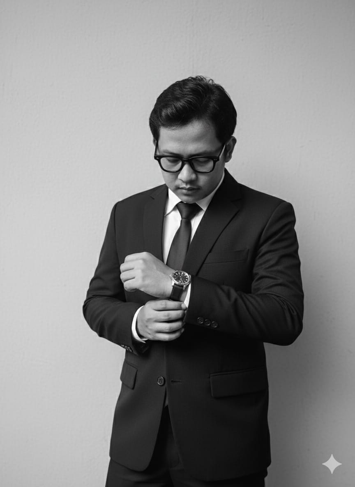

<html lang="id">
<head>
    <meta charset="UTF-8">
    <meta name="viewport" content="width=device-width, initial-scale=1.0">
    <title>Tugas Reifan Syahlevi Regni</title>
    
    <!-- Bagian CSS digabung di sini -->
    
</head>
<body>

    <!-- Menu Atas -->
    <nav class="navbar">
        <ul>
            <li><a href="#">HOME</a></li>
            <li><a href="#">PROFILE</a></li>
            <li><a href="#">ACADEMICS</a></li>
            <li><a href="#">TECH AND HOBBIES</a></li>
            <li><a href="#">PICTURE</a></li>
            <li><a href="#">CONTACT</a></li>
        </ul>
    </nav>

    <!-- Konten Artikel -->
    <article class="post-container">
        
        <h1 class="post-title">"Pemimpin Di Kelas, Eksplorator Di Dunia Digital"</h1>

        

            <!-- JANGAN LUPA GANTI INI DENGAN NAMA KAMU -->
            POSTED BY Reifan Syahlevi 
            ON 19 JUNE 2026 | NO COMMENT
            311251390027
        

        

            <!-- Gambar dari internet supaya langsung muncul -->
            
            
Halo! Perkenalkan, nama saya Reifan Syahlevi, mahasiswa aktif di Universitas Mitra Bangsa (UMIBA). Selain fokus pada aktivitas perkuliahan, saya juga memegang amanah sebagai Ketua Kelas, yang banyak mengajarkan saya tentang tanggung jawab, <em>public speaking</em>, dan manajemen teman-teman satu angkatan Di luar kesibukan kampus, saya memiliki ketertarikan yang besar terhadap dunia teknologi. Waktu luang saya biasanya diisi dengan mengeksplorasi spesifikasi dan optimasi hardware PC, serta bermain game bergenre action-adventure dan survival horror. Saat ini, saya juga sedang antusias mempraktikkan dasar-dasar web development seperti HTML dan CSS ini untuk mengembangkan kreativitas di dunia digital......

            
            

                <a href="#" class="read-more">Read More</a>
            

        

    </article>

</body>
</html>
